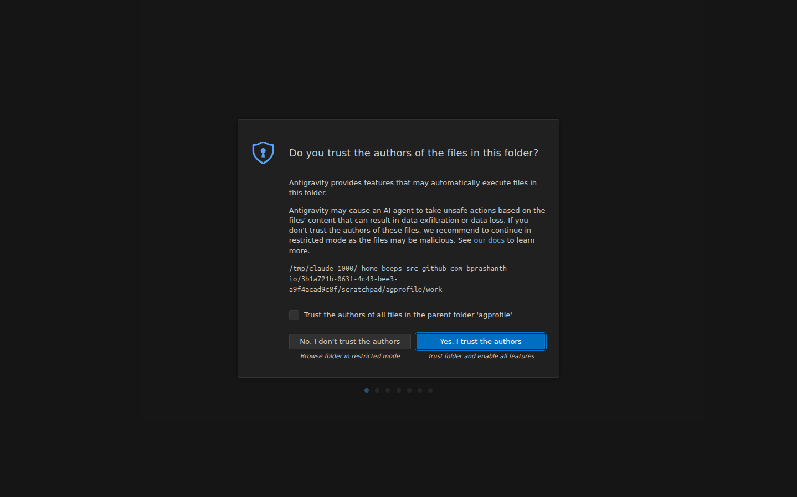
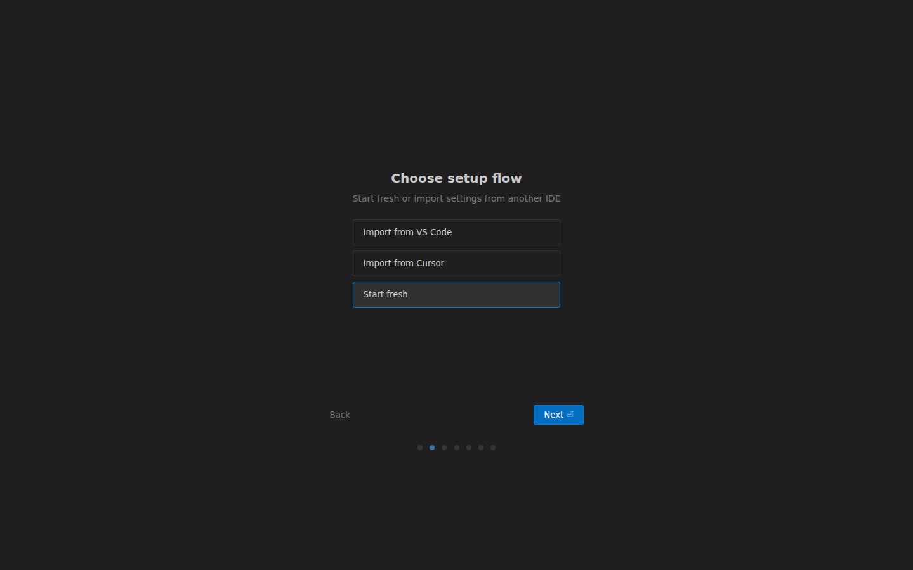
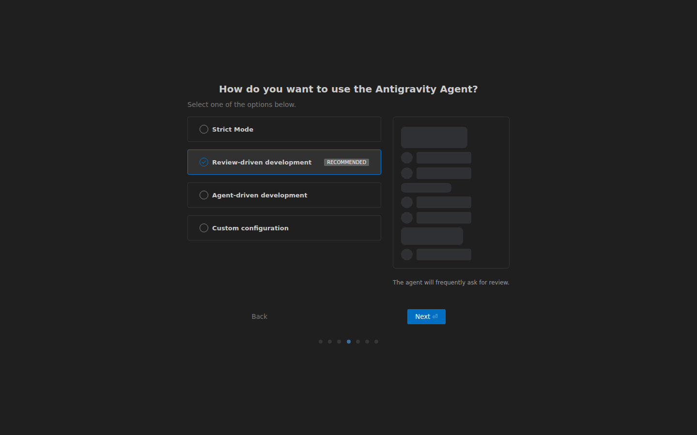
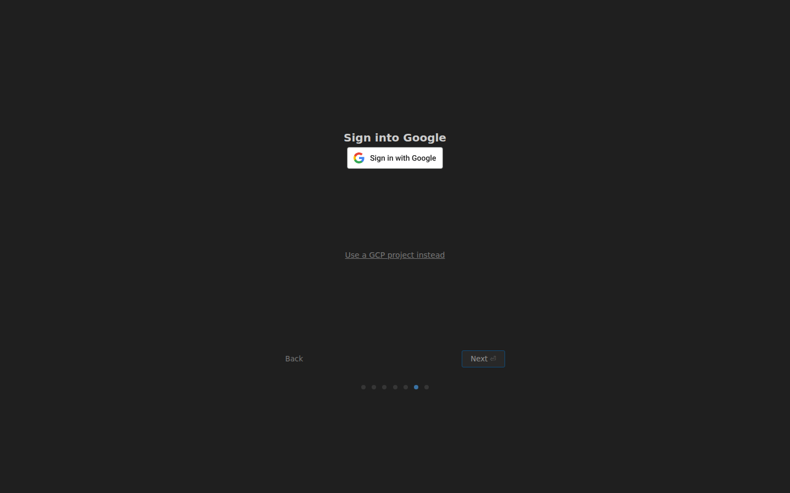

# Antigravity: what to pick the first time you open it

The first run asks a handful of questions. Only three of them matter. Everything else you
can leave as it is and click Next.

## 1. "Do you trust the authors of the files in this folder?"

Click **Yes, I trust the authors**.

This one matters more than it looks. If you pick the other button the folder opens in
restricted mode, and the privacy shield will not run at all. It does not warn you. It is
simply not there.

## 2. "Choose setup flow"

Click **Start fresh**, then Next.

The import options are for people moving over from VS Code or Cursor. You do not need them.

## 3. "How do you want to use the Antigravity Agent?"

**Review-driven development** is selected by default. For the event, pick
**Agent-driven development** instead.

Review-driven means the agent stops and asks you to approve nearly every step. That is a
sensible default for a developer. During a workshop it means clicking Approve every few
seconds instead of looking at your data.

You can change your mind later, see below.

## 4. "Sign into Google"

Click **Sign in with Google** and use your own Google account.

Ignore "Use a GCP project instead" unless the organizers tell you otherwise.

## The other screens

A theme picker and a couple of welcome pages. Nothing there affects how io or the shield
work. Pick whatever you like and click Next.

## Changing it afterwards

If you picked review-driven and are now approving something every few seconds, you do not
have to start over. In the bottom right corner of Antigravity there are two settings,
**Auto Execute** and **Review Policy**. Set both to **Always Proceed**.

Set them back to **Request Review** whenever you want the agent to check with you again.

## Then

Install the privacy shield: back to the [README](../README.md#a-the-privacy-shield-in-antigravity).
